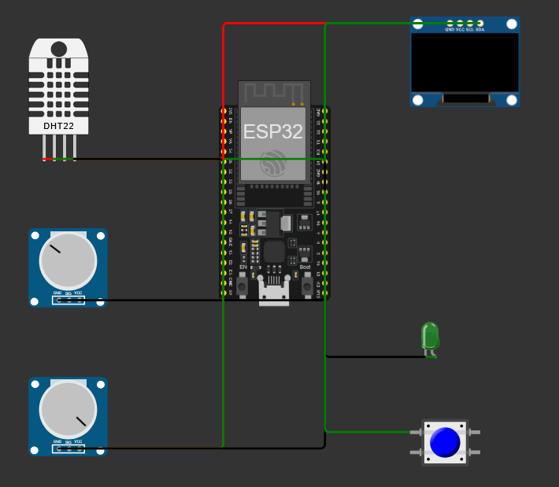
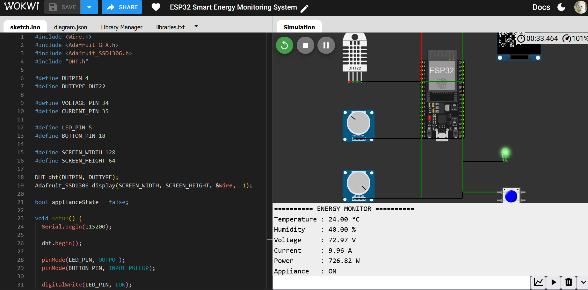
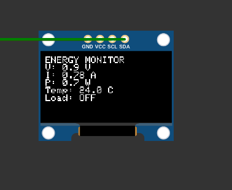

# ⚡ ESP32 Smart Energy Monitoring System

An IoT-based smart energy monitoring system built using **ESP32**. The system monitors simulated voltage and current inputs, calculates power consumption, displays real-time readings on an OLED, and provides appliance control through a pushbutton.

> **Note:** Voltage and current are simulated using potentiometers in Wokwi. This project is a safe simulation and does not measure real mains electricity.

## 📌 Project Overview

The **ESP32 Smart Energy Monitoring System** demonstrates how an IoT device can collect electrical parameters, calculate power consumption, display information locally, and control an appliance.

The system uses:

* ESP32 as the main controller
* DHT22 for temperature and humidity
* Potentiometers as simulated voltage and current inputs
* SSD1306 OLED for real-time display
* Pushbutton for appliance control
* LED as an appliance status indicator

## ✨ Features

* 🌡️ Temperature and humidity monitoring
* ⚡ Simulated voltage measurement
* 🔌 Simulated current measurement
* 📊 Automatic power calculation
* 📺 Real-time OLED display
* 💡 Appliance ON/OFF indicator
* 🎛️ Pushbutton-based appliance control
* 🖥️ Serial Monitor output
* 🧮 ESP32-based data processing

## 🛠️ Components Used

| Component     | Quantity |
| ------------- | -------: |
| ESP32 DevKit  |        1 |
| DHT22         |        1 |
| Potentiometer |        2 |
| SSD1306 OLED  |        1 |
| LED           |        1 |
| Pushbutton    |        1 |

## 🔌 Pin Configuration

| Component          | ESP32 Pin |
| ------------------ | --------- |
| DHT22 Data         | GPIO 4    |
| Voltage Simulation | GPIO 34   |
| Current Simulation | GPIO 35   |
| Appliance LED      | GPIO 5    |
| Pushbutton         | GPIO 18   |
| OLED SDA           | GPIO 21   |
| OLED SCL           | GPIO 22   |

## ⚙️ Working Principle

### 1. Sensor Monitoring

The DHT22 measures temperature and humidity.

### 2. Voltage and Current Simulation

Two potentiometers are used to simulate voltage and current values in the Wokwi environment.

### 3. Power Calculation

The ESP32 calculates electrical power using:

**Power = Voltage × Current**

### 4. OLED Display

The SSD1306 OLED displays:

* Voltage
* Current
* Power
* Temperature
* Appliance status

### 5. Appliance Control

The pushbutton toggles the appliance between **ON** and **OFF**.

The LED represents the appliance status.

## 🧪 Testing

The system was tested under different simulated conditions.

### Normal Condition

* Temperature: **24.00 °C**
* Humidity: **40.00 %**
* Voltage: **0.94 V**
* Current: **0.78 A**
* Power: **0.73 W**
* Appliance: **OFF**

### High Power Simulation

* Voltage: **72.97 V**
* Current: **9.96 A**
* Power: **726.82 W**
* Appliance: **ON**

### Appliance Control

The pushbutton was tested successfully:

**OFF → ON → OFF**

The LED indicator responded correctly.

## 📸 Screenshots

### Wokwi Circuit

### Normal Output

### High Power Output

### OLED Display

## 💻 Technologies Used

* **ESP32**
* **Arduino C++**
* **DHT22**
* **SSD1306 OLED**
* **I2C Communication**
* **Analog Input**
* **Wokwi Simulation**

## 📚 Libraries Used

* DHT sensor library
* Adafruit GFX Library
* Adafruit SSD1306

## 🎯 Learning Outcomes

Through this project, I learned:

* Reading analog sensor inputs with ESP32
* Working with DHT22 sensors
* Interfacing an I2C OLED display
* Performing real-time calculations
* Controlling appliances using digital output
* Using pushbuttons with `INPUT_PULLUP`
* Combining multiple sensors and peripherals in one IoT system
* Building and testing an IoT project using Wokwi

## 🚀 Future Improvements

Possible future improvements include:

* Real current sensor integration
* Real voltage sensing circuit
* Energy consumption logging
* Cloud dashboard integration
* Historical energy analysis
* Mobile monitoring
* Automatic energy-saving control

## 👩‍💻 Author

**Tanisha Karan**

B.Tech — Computer Science / IoT

Interested in **IoT, Embedded Systems, Sensors, and Smart Automation**.
